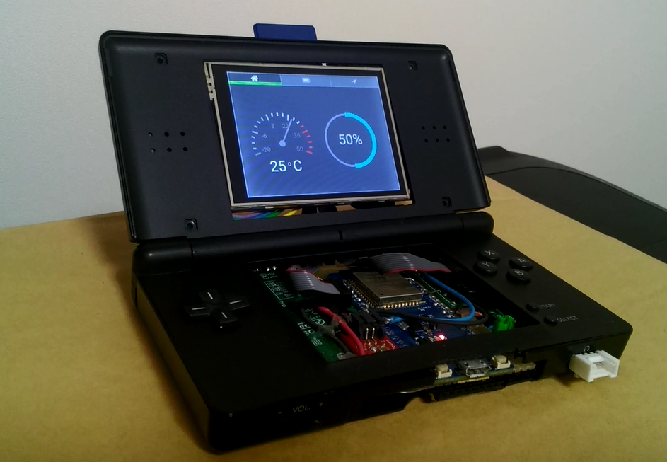
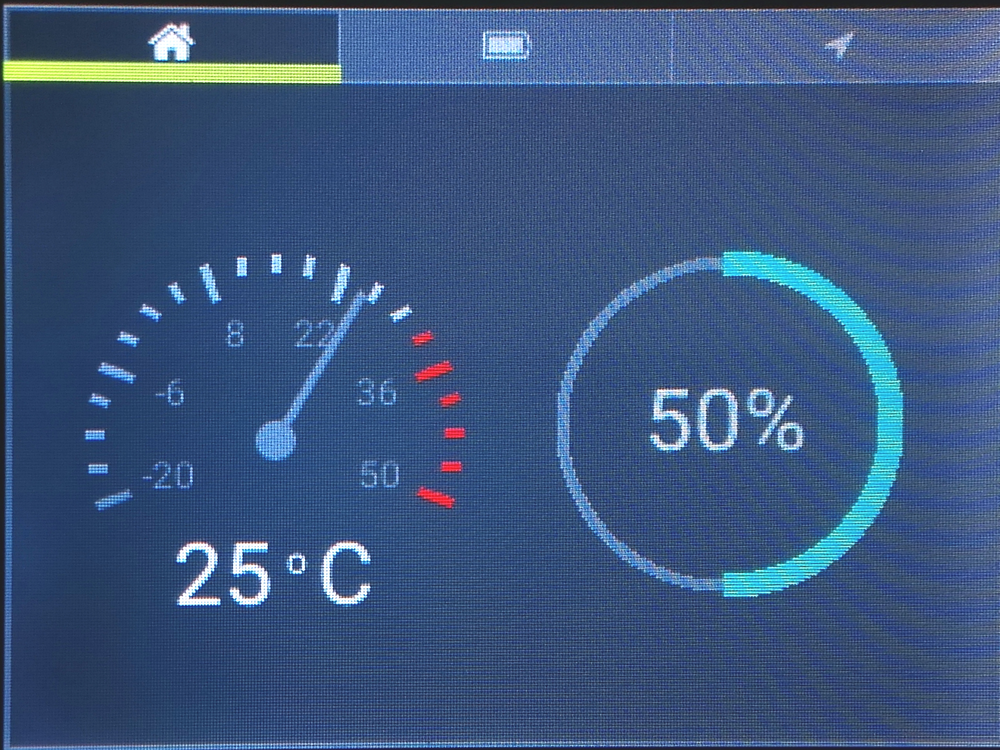
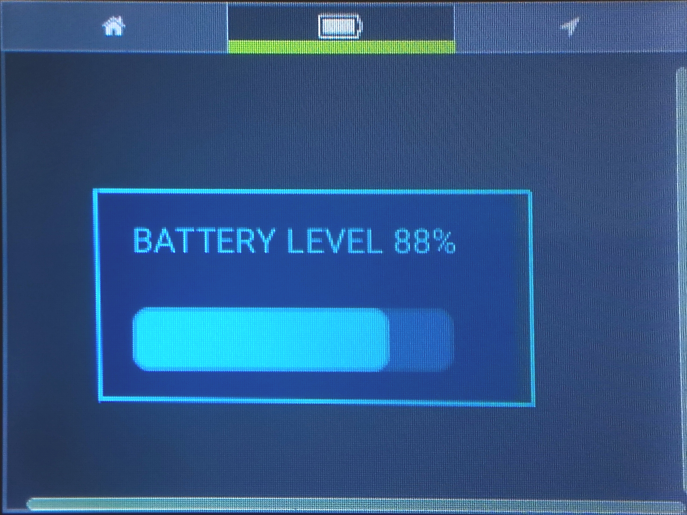
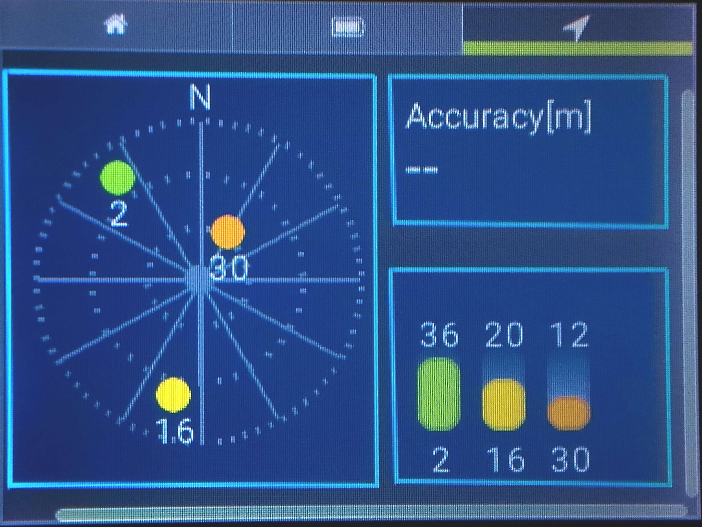

# LittlevGL example for ESP32

Examples for LittlevGL applications(mock-up).

  





## Get started 
### Install the ESP32 SDK
1. Get base projects: `git clone --recursive https://github.com/bigw00d/esp-idf-littlevgl-sample.git`

### Add LittlevGL to the build
To link LittlevGL (lvgl) and lv_examples with ESP-IDF you need to add a **component.mk** file to each directory.

Espressif recommends to add third party software into a directory named **components**, so `lvgl` and `lv_examples` directories are located in a directory named **components**.

Next to this README file you find two component.mk template files:
- lvgl_component.mk
- lv_example_component.mk

Rename `lvgl_component.mk` to `component.mk` and move it to the `lvgl` directory, then rename `lv_example_component.mk` to `component.mk` and move it to the `lv_examples` directory, remember `lvgl` and `lv_examples` directories are located into the **components** directory.

## ESP32 dev board

[ESPr® Developer 32](https://www.switch-science.com/catalog/3210/)


##  Pin connections
|ESP32  |LCD  |
|---|---|
|VOUT  |VCC  |
|GND  |GND  |
|IO5  |CS  |
|IO16  |RES  |
|IO17  |DC  |
|IO23  |MOSI  |
|IO18  |SCK  |
|3V3  |LED  |
|IO19  |MISO  |

## Pin configurations

### ILI9341
For ILI9341 VSPI is used, modify the pin configuration in `components/drv/disp_spi.h` to:

```c
#define DISP_SPI_MOSI 23
#define DISP_SPI_CLK  18
#define DISP_SPI_CS   5
```

and `components/drv/ili9341.h` to:
```c
#define ILI9341_DC   17
#define ILI9341_RST  16
#define ILI9341_BCKL 4 //dummy (NC)
```

## Rotate configurations

### ILI9341
Modify the configuration in `components/drv/ili9341.c` to:

```c
#if ILI9341_INVERT_DISPLAY
  uint8_t data[] = {0xF8};
```

and `components/drv/ili9341.h` to:
```c
#define ILI9341_INVERT_DISPLAY 1
```

### Flash to ESP32
1. Go to the project's directory: `cd esp-idf-littlevgl-sample`
2. Build the project: `make`
3. Upload the application to your board: `make flash`


## Note

- Connect a 10 uF electrolytic capacitor between the EN pin and GND. : https://randomnerdtutorials.com/solved-failed-to-connect-to-esp32-timed-out-waiting-for-packet-header/ 

